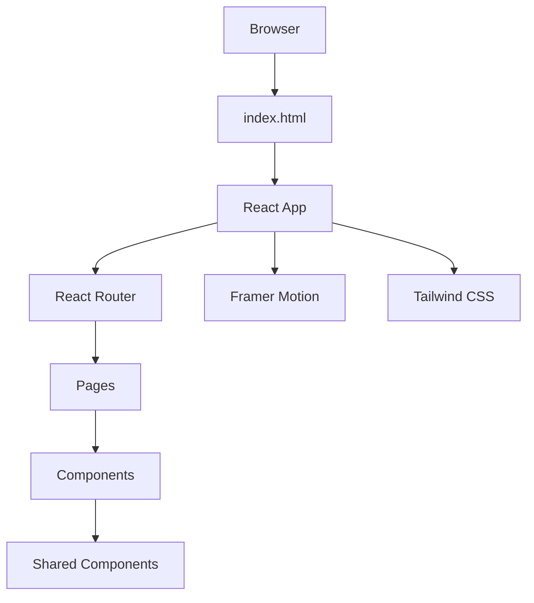
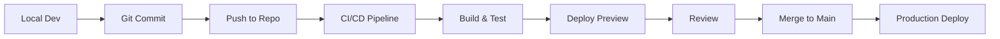

# Arsitektur Sistem OurCreativities

> Dokumentasi arsitektur teknis platform OurCreativities v5.0

## Overview

OurCreativities dibangun sebagai Single Page Application (SPA) menggunakan React dengan routing client-side. Arsitektur dirancang untuk scalability, maintainability, dan performance optimal.

## High-Level Architecture



## Struktur Folder

```
ourcreativities/
├── components/           # Komponen reusable
│   ├── BentoGrid.tsx
│   ├── BottomCTA.tsx
│   ├── Footer.tsx
│   ├── Hero.tsx
│   └── Navbar.tsx
├── pages/               # Halaman utama aplikasi
│   ├── Home.tsx
│   ├── Karya.tsx
│   ├── Tim.tsx
│   ├── Story.tsx
│   └── Info.tsx
├── docs/                # Dokumentasi
│   ├── versions/        # Riwayat versi
│   ├── ARCHITECTURE.md  # File ini
│   ├── COMPONENTS.md
│   ├── PAGES.md
│   ├── DEPLOYMENT.md
│   └── CONTRIBUTING.md
├── App.tsx              # Root component
├── index.tsx            # Entry point
├── index.html           # HTML template
├── index.css            # Global styles
├── vite.config.ts       # Vite configuration
├── tsconfig.json        # TypeScript config
└── package.json         # Dependencies
```

## Component Architecture

### Component Hierarchy

```
App
├── ScrollToTop (Utility)
├── Background Ambience (Visual)
├── Navbar (Navigation)
├── Main (Content Container)
│   └── AnimatedRoutes
│       ├── Home
│       │   ├── Hero
│       │   ├── BentoGrid
│       │   └── BottomCTA
│       ├── Karya
│       ├── Tim
│       ├── Story
│       └── Info
└── Footer
```

### Component Types

**Layout Components:**
- `App.tsx` - Root container
- `Navbar.tsx` - Navigation bar
- `Footer.tsx` - Page footer

**Content Components:**
- `Hero.tsx` - Hero section
- `BentoGrid.tsx` - Grid layout
- `BottomCTA.tsx` - Call-to-action

**Page Components:**
- `pages/Home.tsx`
- `pages/Karya.tsx`
- `pages/Tim.tsx`
- `pages/Story.tsx`
- `pages/Info.tsx`

## Routing System

### React Router Implementation

**Router Type:** MemoryRouter
- Alasan: SPA tanpa server-side routing
- Client-side navigation
- No URL persistence (dapat diubah ke BrowserRouter)

**Route Configuration:**
```typescript
<Routes>
  <Route path="/" element={<Home />} />
  <Route path="/karya" element={<Karya />} />
  <Route path="/tim" element={<Tim />} />
  <Route path="/story" element={<Story />} />
  <Route path="/info" element={<Info />} />
  <Route path="*" element={<Navigate to="/" />} />
</Routes>
```

**Route Features:**
- Automatic scroll to top
- Page transitions dengan Framer Motion
- 404 redirect ke home
- AnimatePresence mode="wait"

## Styling Architecture

### Tailwind CSS System

**Configuration:**
- CDN-based Tailwind CSS
- Custom config di index.html
- Extended color palette
- Custom font families

**Custom Theme:**
```javascript
{
  colors: {
    background: '#050505',
    surface: '#0f0f0f',
    surfaceHighlight: '#1a1a1a',
    primary: '#ffffff',
    accentRed: '#e11d48',
    accentPurple: '#a855f7'
  },
  fontFamily: {
    sans: ['Inter', 'sans-serif'],
    serif: ['Playfair Display', 'serif']
  }
}
```

### Global Styles

**index.css:**
- CSS reset/normalize
- Custom scrollbar
- Global animations
- Utility classes

**Design Tokens:**
- Spacing scale: 4px base
- Border radius: 0.5rem default
- Shadow system: 3 levels
- Animation duration: 200-600ms

## Animation System

### Framer Motion

**Usage Patterns:**

**Page Transitions:**
```typescript
<AnimatePresence mode="wait">
  <motion.div
    initial={{ opacity: 0 }}
    animate={{ opacity: 1 }}
    exit={{ opacity: 0 }}
  />
</AnimatePresence>
```

**Component Animations:**
- Entrance animations
- Hover states
- Scroll-based triggers
- Gesture animations

**Performance Considerations:**
- Use transform & opacity
- Avoid animating width/height
- Hardware acceleration
- Reduce motion respect

## State Management

### Current Approach

**Local State:**
- React useState untuk component state
- No global state management (yet)
- Props drilling untuk shared state

**Future Considerations:**
- Context API untuk theme
- React Query untuk data fetching
- Zustand/Jotai untuk global state

## Build System

### Vite Configuration

**Features:**
- Fast HMR (Hot Module Replacement)
- ESbuild untuk bundling
- TypeScript support
- React plugin

**Build Optimization:**
```typescript
// vite.config.ts
export default defineConfig({
  plugins: [react()],
  build: {
    rollupOptions: {
      output: {
        manualChunks: {
          vendor: ['react', 'react-dom'],
          router: ['react-router-dom'],
          animation: ['framer-motion']
        }
      }
    }
  }
})
```

## TypeScript Setup

**Configuration:**
- Strict mode enabled
- React types included
- @types/node untuk utilities

**Type Safety:**
- Component props typed
- Event handlers typed
- No implicit any
- Strict null checks

## Performance Strategy

### Optimization Techniques

**Code Splitting:**
- Route-based splitting
- Component lazy loading
- Vendor chunk separation

**Asset Optimization:**
- Image lazy loading
- Font preloading
- Resource hints (preconnect)
- Critical CSS inlining

**Runtime Optimization:**
- React.memo untuk expensive components
- useMemo untuk calculations
- useCallback untuk event handlers
- Virtualization untuk long lists

## Security Considerations

### Current Implementation

**Input Sanitization:**
- No user input currently
- Prepared for future forms

**XSS Prevention:**
- React default escaping
- No dangerouslySetInnerHTML

**Dependencies:**
- Regular updates
- CodeQL scanning
- Vulnerability monitoring

## Scalability Considerations

### Current Limitations

**Static Content:**
- Hard-coded data
- No CMS integration
- Manual updates required

**Future Scaling Path:**

**Phase 1: CMS Integration**
- Headless CMS (Strapi/Contentful)
- API integration
- Content management UI

**Phase 2: Backend Services**
- User authentication
- Database integration
- Real-time features

**Phase 3: Microservices**
- Service separation
- API gateway
- Scalable infrastructure

## Deployment Architecture

**Current:**
```
Git Push → Build → Deploy → CDN
```

**Stack:**
- Hosting: Vercel/Netlify
- CDN: Automatic
- SSL: Automatic
- Domain: Custom domain ready

## Monitoring & Analytics

**Planned Integration:**
- Google Analytics
- Sentry error tracking
- Web Vitals monitoring
- User behavior analytics

## Accessibility Architecture

**WCAG 2.1 Level AA:**
- Semantic HTML5
- ARIA labels
- Keyboard navigation
- Focus management
- Color contrast

## Browser Support

**Target Browsers:**
- Chrome 90+
- Firefox 88+
- Safari 14+
- Edge 90+

**Progressive Enhancement:**
- Feature detection
- Graceful degradation
- Polyfills strategy
- Fallback experiences

## Development Workflow



## Testing Strategy

**Current:**
- Manual testing
- Browser testing
- Performance testing

**Planned:**
- Unit tests (Vitest)
- Integration tests
- E2E tests (Playwright)
- Visual regression tests

## Technical Debt

**Known Issues:**
- No automated testing
- No error boundaries
- Limited error handling
- Hard-coded content

**Mitigation Plan:**
- Prioritize testing setup
- Add error boundaries
- Implement proper error handling
- CMS integration planning

## Future Architecture

**v6.0 Vision:**
- Microservices architecture
- Real-time features (WebSocket)
- Advanced caching strategies
- Edge computing integration
- AI-powered features

---

**Last Updated:** November 2025  
**Version:** 5.0  
**Maintainer:** OurCreativities Team
